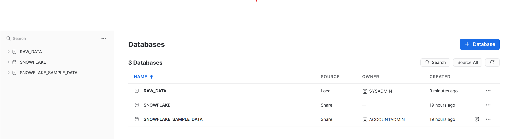
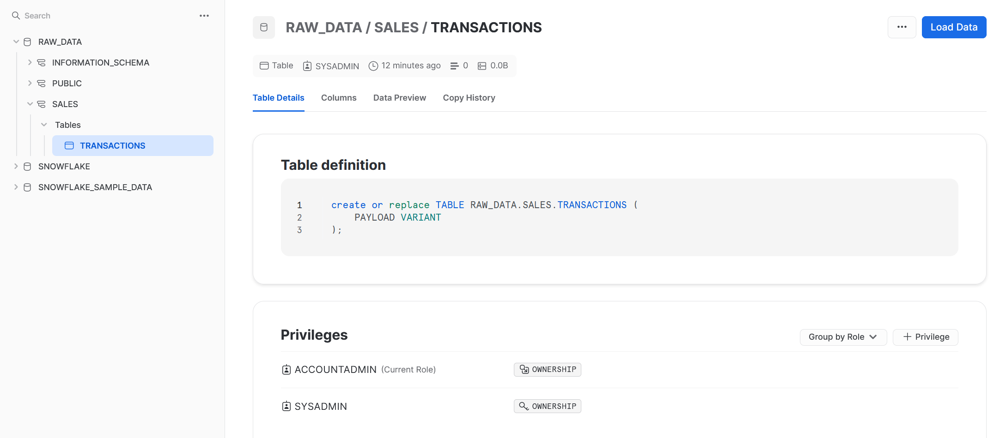
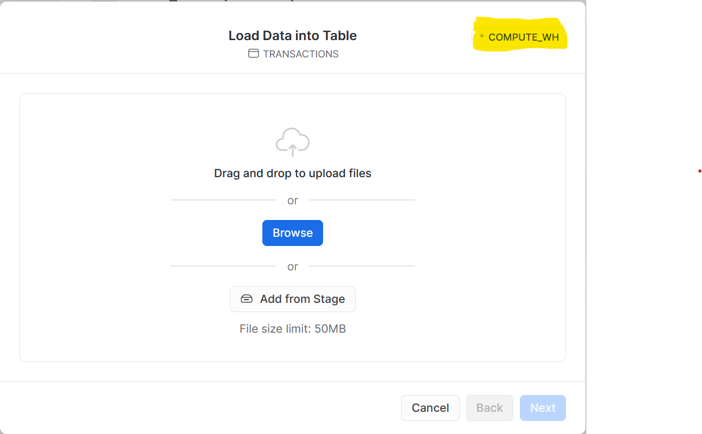
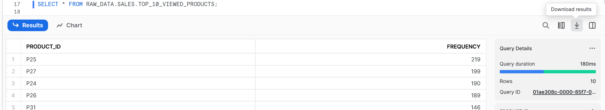
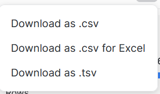
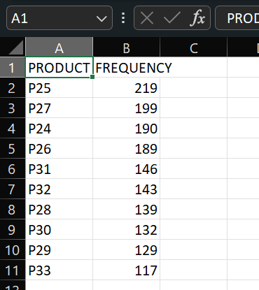

#data-engineering 

## Some good points

Got to be certain which role you're using
Worksheets are the queries to run and where to write them
ctrl+enter for line by line
Blue button in top right to run whole query.

Dashboards produce visualisations.
Streamlit is great to write graphs in
Snowflake is odd - there are multiple different ways to do things

## Why snowflake?
- Better dev experience, integrated tooling for azure, bigquery, redshift.
- Unique flavour of SQL - Built in connectors and integrations to react to an event occurring and respond accordingly within the warehouse
- Semi-structured and unstructured data - can't really do in other environments
- Built in capability - was classical warehouse but now many other things, data vis stats, how nice out-of-the-box everything is

## Hierarchy within Snowflake

![[Pasted image 20240722142104.png]]

Capability to create new users, multiple users who can do different things - warehouse between account and database, multiple dataases or might live inside it


# Creating resources

You can either use worksheets in the GUI or execute SQL commands with the CLI tool SnowSQL, which we will come on to later.

## Resources overview

## Creating users [docs](https://docs.snowflake.com/en/sql-reference/sql/create-user.html)

A 'user' is user identity recognised by Snowflake, whether associated with a real person or program.

In a new worksheet, try running:

    USE ROLE SECURITYADMIN;

This will change the role for your _current worksheet_ only.

Now we have adopted the security admin role, we can create users and roles.

    CREATE USER IF NOT EXISTS JohnnyLawrence password='superSecretPass' default_role = PUBLIC must_change_password = true;

The Snowflake docs will provide a list of all arguments you can pass during user creation, for example including a user's email address, though the above is enough to get started.

## Create roles [docs](https://docs.snowflake.com/en/sql-reference/sql/create-role.html)

Snowflake uses roles to control the objects (virtual warehouses, databases, tables, etc.) that users can access:

* Snowflake provides a set of predefined roles, as well as a framework for defining a hierarchy of custom roles.
* All Snowflake users are automatically assigned the predefined PUBLIC role, which enables login to Snowflake and basic object access.
* In addition to the PUBLIC role, each user can be assigned additional roles, with one of these roles designated as their default role. A user’s default role determines the role used in the Snowflake sessions initiated by the user; however, this is only a default. Users can change roles within a session at any time.
* Roles can be assigned at user creation or afterwards.

```sql
    CREATE ROLE IF NOT EXISTS DATA_CONSUMER COMMENT = 'Role to access raw data';
```

Take a look at all the system users and roles created so far:

List users:

    

List roles:

    SHOW ROLES;

> **IMPORTANT NOTE:** Objects are not case sensitive unless "quoted". See [Identifier Requirements](https://docs.snowflake.com/en/sql-reference/identifiers-syntax.html) for more info around case sensitivity and allowed characters in Snowflake

### Assigning a role to a user

    GRANT ROLE DATA_CONSUMER TO USER JohnnyLawrence;

### Assigning a role to another role

We can create a role hierarchy by assigning roles to other roles.

    GRANT ROLE DATA_CONSUMER TO ROLE SYSADMIN;

This means that any user with the SYSADMIN role, is also able to switch to the DATA_CONSUMER role. However, JohnnyLawrence is only able to use the DATA_CONSUMER role.

## Virtual Warehouses

Warehouses provide a cluster of compute resource needed for querying your data. A default warehouse called `COMPUTE_WH` is created for us when we create the trial account.
To allow the SYSADMIM role to use this warehouse, we will need to grant it the required permissions.

    GRANT USAGE ON WAREHOUSE COMPUTE_WH TO ROLE SYSADMIN;

We can have warehouses of all different sizes to satisfy different use cases. Later we will create a seperate warehouse to be used for reporting.

## Create databases [docs](https://docs.snowflake.com/en/sql-reference/sql/create-database.html)

To instantiate resources like databases, you must adopt the `SYSADMIN` role:

    USE ROLE SYSADMIN;
    CREATE DATABASE RAW_DATA;

To enable roles to access the database we must grant permissions:

    GRANT USAGE ON DATABASE RAW_DATA TO DATA_CONSUMER;

## Create schemas [docs](https://docs.snowflake.com/en/sql-reference/sql/create-schema.html)

    USE DATABASE RAW_DATA;
    CREATE SCHEMA SALES;

## Create Tables [docs](https://docs.snowflake.com/en/sql-reference/sql/create-table.html)
We need a table for our data to go in, so we'll use the CREATE TABLE. This lets us give the table a name and define the name and data type for each column in the table.

### Data Types [docs](https://docs.snowflake.com/en/sql-reference/intro-summary-data-types.html)

Snowflake supports most of the standard data types (strings, numbers, booleans, dates) as well as the VARIANT data type for semi-structured data and the GEOGRAPHY data type for geospatial data: [docs](https://docs.snowflake.com/en/sql-reference/intro-summary-data-types.html)

We will consume JSON data and so choose a single column of the Snowflake's special VARIANT type which allows importing and querying of semi-structured data.

    CREATE TABLE RAW_DATA.SALES.TRANSACTIONS (PAYLOAD VARIANT);


VARIANT defers the decision apart format of data, a few more options for structuring data.


My Snowflake SQL Code below:

```sql
USE ROLE SECURITYADMIN;

Create user if not exists JohnS password = 'changemeboy' default_role = public must_change_password = true;

CREATE ROLE IF NOT EXISTS DATA_CONSUMER COMMENT = 'Role to access raw data';

Grant role data_consumer to user JohnS;

grant role data_consumer to role sysadmin;

 GRANT USAGE ON WAREHOUSE COMPUTE_WH TO ROLE SYSADMIN;

 USE ROLE SYSADMIN;
 CREATE DATABASE IF NOT EXISTS RAW_DATA;

 Grant usage on database RAW_DATA to DATA_CONSUMER;
 Create schema SALES;

 CREATE TABLE IF NOT EXISTS RAW_DATA.SALES.TRANSACTIONS (PAYLOAD VARIANT);

 DESCRIBE TABLE RAW_DATA.SALES.TRANSACTIONS
```

# Loading data via the Snowflake UI [[docs](https://docs.snowflake.com/en/user-guide/data-load-web-ui.html)]

## The Snowflake Load Data Wizard

To load ad-hoc files into Snowflake, we can use the Snowflake Load Data Wizard which is part of the Snowflake UI. In the _real world_, you would usually build a data pipeline to automate this but the Load Data Wizard is a great way to easily import data while you are developing and testing new functionality for your data warehouse.

To load data into the transactions table, we can use Snowflake's built-in table stage. A stage is a temporary holding area for data which we'll use to load our files into Snowflake. We don't need to dive too deep into stages at this stage but for the curious, further reading can be found [here](https://docs.snowflake.com/en/user-guide/data-load-local-file-system-create-stage.html).

## Getting the data

Sample transaction data has been provided in a public S3 bucket `snowflake-101` based on shopping baskets for a supermarket.

### Transactions files

To download the files, you have a couple of options:

1. Via your web browser:

    Visit <https://snowflake-101.s3.eu-west-1.amazonaws.com/all_transactions.json> and save the file/page to your local disk.

1. In your **terminal** using `curl`. **NOTE: Do not run this in your Snowflake worksheet**

        curl https://snowflake-101.s3.eu-west-1.amazonaws.com/all_transactions.json > all_transactions.json

## Loading data via the console UI

To load data via the console, navigate to the Data tab of the main menu. If you're in a worksheet, you will need to click the `< Worksheets` button in the top-left to get back ot the main menu.



### Use the tree view to navigate to the table you wish to upload data into



### Click on Load Data in the top right

You'll now be taken through a series of options to choose the file you're loading, and its file format.

### Select your warehouse

The `COMPUTE_WH` warehouse has been automatically selected. This is correct for this example, but if you ever need to change to a different warehouse, you can do that in the top-right of the window.



### Choose your files to upload

Either drag and drop the `all_transactions.json` file onto this window, or click the `Browse` button to select it.

At this point you must choose a `FILE FORMAT` which defines your data;

## File formats [docs](https://docs.snowflake.com/en/sql-reference/sql/show-file-formats.html)

File formats are used to define custom data structures, whether that be unstructured JSON or relational CSV data; they instruct Snowflake how to read and handle the data you wish to upload. File formats belong to a database and schema. A file format can receive instructions including if the file is compressed or not, the encoding, whether the CSV file has a header row (column names), and how Snowflake handles errors when it receives bad data.

Let's continue with the wizard. Our data is JSON so select the `File format` as JSON .

There are several options which allow you to control how the data is loaded, but for this example we can just use the defaults. Note the very bottom option which lets you control what happens if there's an error. You may wish to fail the whole file and load no data (this is the default behaviour), or load the valid data from the file and discard the invalid data.

Click `Load` to load the data into your `TRANSACTIONS` table.


You can now click the `Query Data` button which will open a new worksheet, run the query and you can see the data which has been loaded. If you clock on one of the lines in the results, you'll see the JSON for that line on the right, this is usuallyt easier to read than looking directly at the results


# Querying Data


To view and query data, swap back to a worksheet if you're not there already.

The most basic query is to retrieve everything from our table:

    SELECT * FROM RAW_DATA.SALES.TRANSACTIONS;

When you're just looking to see what data is in a table it is good practice to limit how many rows are returned in your query. This stops the database from having to retreive every row and display it, which can be very costly if there are millions or even billions of rows. We do this by adding a `LIMIT` clause to the end of our query.

    SELECT * FROM RAW_DATA.SALES.TRANSACTIONS LIMIT 10;


Snowflake can query JSON and other semi-structured data from within a VARIANT column too:

    SELECT PAYLOAD:"PRODUCTS_VIEWED" FROM RAW_DATA.SALES.TRANSACTIONS;

You can use a colon to traverse the keys in the JSON to get to the required element, in this case `"PRODUCTS_VIEWED"`.


## Unpacking lists and arrays in data

We can explode lists within a nested JSON structure in a VARIANT field to flatten the data into separate rows for easier analysis [[docs](https://docs.snowflake.com/en/sql-reference/functions/flatten.html)]


    SELECT
        PAYLOAD:CUSTOMER_ID::VARCHAR AS customer_id,
        FLATTENED_DATA.VALUE:PRODUCT_ID::VARCHAR AS product_id,
        FLATTENED_DATA.VALUE:PRICE::NUMBER AS price,
        PAYLOAD:DATE_OF_SESSION::TIMESTAMP AS DATE_OF_SESSION
    FROM
        RAW_DATA.SALES.TRANSACTIONS AS TRANSACTIONS,
        LATERAL FLATTEN(input => TRANSACTIONS.PAYLOAD, path => 'PRODUCTS_VIEWED') AS FLATTENED_DATA;


This query specifies the database and schema where the table lives; if you do not specify them you must set the context as seen previously with:

    USE DATABASE RAW_DATA;
    USE SCHEMA SALES;

We can find insights like the most popular products sold:

    SELECT
        FLATTENED_DATA.VALUE:PRODUCT_ID::VARCHAR AS PRODUCT_ID,
        SUM(1) AS FREQUENCY
    FROM
        TRANSACTIONS AS TRANSACTIONS,
        LATERAL FLATTEN(input => TRANSACTIONS.PAYLOAD, path => 'PRODUCTS_VIEWED') AS FLATTENED_DATA
    GROUP BY
        FLATTENED_DATA.VALUE:PRODUCT_ID
    ORDER BY
        FREQUENCY DESC;

## Creating a view [docs](https://docs.snowflake.com/en/user-guide/views-introduction.html)

Useful queries can be saved as a view, this stores the data manipulation language (the sql statement or DML) in a table-like object so we can recall the data on the fly - quickly.

The physical data is not stored again but instead acts as a handy shortcut to run complex queries.

We will create this view using the SYSADMIN role.

    CREATE OR REPLACE VIEW RAW_DATA.SALES.TOP_10_VIEWED_PRODUCTS AS
    (
        SELECT
            FLATTENED_DATA.VALUE:PRODUCT_ID::VARCHAR AS PRODUCT_ID,
            SUM(1) AS FREQUENCY
        FROM
            RAW_DATA.SALES.TRANSACTIONS AS TRANSACTIONS,
            LATERAL FLATTEN(input => TRANSACTIONS.PAYLOAD, path => 'PRODUCTS_VIEWED') AS FLATTENED_DATA
        GROUP BY
            FLATTENED_DATA.VALUE:PRODUCT_ID
        ORDER BY
            FREQUENCY DESC
        LIMIT 10
    ); 

To run the view, use:

    SELECT * FROM RAW_DATA.SALES.TOP_10_VIEWED_PRODUCTS;

The useful thing about Views is that they are automatically up to date as their source data changes. So as more transactions get loaded in the future, the `"TOP_10_VIEWS_PRODUCTS"` view will always contain the top 10 most viewed products.

>### A note on database design
>
>It would be a better design to create a new database for the `"TOP_10_VIEWS_PRODUCTS"` view to go in, rather than it going in the RAW_DATA database.
>
>This is a principle called Seaparation of Concerns, where each component has a defined role to play. The RAW_DATA database should only contain raw, untouched data. By adding logic to find the 10 most viewed products, this is no longer raw data and so should sit in a separate database.
>
>But for the purposes of simplicity in this introduction we'll create it in RAW_DATA.

## Granting Permissions on this view and creating a reporting warehouse

If we were to log in as JohnnyLawrence, they only have the DATA_CONSUMER role, and therefore would not be able to see this useful view that we've created as a SYSADMIN. We need to explicity grant permissions to the DATA_CONSUMER role so they can see this view, and we also need to grant them compute power though a virtual warehouse to run their queries.

We could use the same warehouse we have used for loading the data across both roles, but this can become a challenge when you're increasing the scale or your data warehouse. Queries get queued when you have stretched a warehouse to it's limits, and you don't want the CEO waiting on their report to load because you're trying to load a massive JSON file at the same time!

### Creating a new warehouse

    USE ROLE SYSADMIN;
    CREATE OR REPLACE WAREHOUSE Reporting_WH WAREHOUSE_SIZE = 'Medium';
    GRANT USAGE ON WAREHOUSE Reporting_WH TO ROLE DATA_CONSUMER;

### Grant Permissions

    GRANT USAGE ON SCHEMA RAW_DATA.SALES TO ROLE DATA_CONSUMER;
    GRANT SELECT ON VIEW RAW_DATA.SALES.TOP_10_VIEWED_PRODUCTS TO ROLE DATA_CONSUMER;

If we now swap to the DATA_CONSUMER role

    USE ROLE DATA_CONSUMER;

You can see they can access the nice, business friendly view, but are blocked when trying to access the raw data.

    SELECT * FROM RAW_DATA.SALES.TOP_10_VIEWED_PRODUCTS;
    SELECT * FROM RAW_DATA.SALES.TRANSACTIONS;


## Unloading Data

# Downloading (unloading) data from Snowflake [docs](https://docs.snowflake.com/en/user-guide-data-unload.html)

Now you have some interesting insights you might want to share your findings with your team and stakeholders. If they don't have direct access to Snowflake, we'll need to export it into a common format.

There are a number of ways to export data (for non-technical people, being able to query a SQL data warehouse isn't much use); one could use the programmatic connectors (Python, Go, Node.js etc.), the SnowSQL CLI, visualisation tools with native Snowflake support (AWS QuickSight, Tableau, Microsoft Power BI), or by using the `COPY INTO` command in the opposite direction to copy from Snowflake to S3 or other blob storage. The simplest method when doing ad-hoc development is to export via the web UI after running your query.

## Exporting data from query results

Let's start by querying the view we made:

    SELECT * FROM RAW_DATA.SALES.TOP_10_VIEWED_PRODUCTS;

Next, hit the `Download results` button.



You'll be presented with a few options to decide the delimiter (what separates the columns in the file) and file name. One of the most common file formats to consume is a `.csv`; this can be opened by a vast number of applications, including Microsoft Excel.

There is a specific option for `.csv for Excel` which, at the time of writing (August 2023), seems to simply add an extra blank line at the top of the file. So for now, stick to the plain `.csv` or `.tsv`. This may change in the future, if you're having trouble loading certain `.csv` files into Excel, give the `.csv for Excel` option a go.



Congratulations, you've exported your data!



